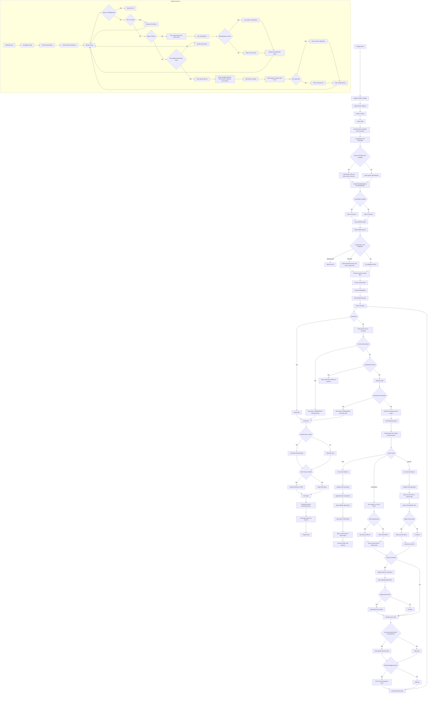

# MASt3R-SLAM `main.py` 白話導讀

這份筆記是對 [`thor/MASt3R-SLAM/main.py`](/home/hrc/Desktop/projects/locobot/thor/MASt3R-SLAM/main.py:1) 的逐段白話解釋。

目標不是逐行翻譯 Python，而是幫我在看 code 時一直記得：

1. 這一段在整個 pipeline 的角色是什麼
2. 它跟前後哪一段接起來
3. 這個變數/函式到底是資料、控制訊號，還是演算法本體

---

## 先講整體：`main.py` 是整個系統的 orchestration

這支檔案本身不太做重數學，它主要是在「排流程」。

它做的事情可以壓成這幾步：

1. 讀設定、讀資料集、建立共享狀態
2. 啟動 visualization process
3. 啟動 backend optimization process
4. 主執行緒一張一張讀影像，做前端 tracking
5. 視情況新增 keyframe
6. 丟 task 給 backend 做 factor graph / pose optimization
7. 定期存結果，結束時收尾

所以可以把 `main.py` 看成：

- 主執行緒 = 前端 tracking 管線
- backend process = 後端 global optimization
- viz process = 顯示用，不是演算法核心

---

## 讀檔時最重要的 6 個名詞

先記住這 6 個，後面比較不會亂：

- `dataset`：影像來源，一張一張吐 frame
- `frame`：當前正在處理的單幀
- `keyframes`：被挑進地圖的關鍵幀集合
- `states`：前後端共享的狀態區
- `mode`：系統現在在 INIT / TRACKING / RELOC 哪個狀態
- `global_optimizer_tasks`：後端待處理的 keyframe 優化任務

---

## 區塊 1：import 區

對應 [`main.py:1-26`](/home/hrc/Desktop/projects/locobot/thor/MASt3R-SLAM/main.py:1)

這裡大概可以分三類：

### 1. Python / 工具層

- `argparse`, `pathlib`, `signal`, `sys`, `time`, `datetime`
- `cv2`, `tqdm`, `yaml`

這些是拿來做 CLI、檔案處理、時間控制、存圖、讀 YAML 的。

### 2. 深度學習 / 幾何層

- `torch`
- `lietorch`

`torch` 負責 tensor / model。

`lietorch` 在這裡很重要，因為 pose 不是普通矩陣在亂乘，它包成 Lie group 形式，像 `Sim3`、`SE3` 這種幾何物件就靠它處理。

### 3. MASt3R-SLAM 內部模組

- `FactorGraph`：後端 global optimization 核心
- `load_config`, `config`：設定檔讀入
- `load_dataset`：把 dataset path 轉成可迭代資料源
- `SharedKeyframes`, `SharedStates`, `create_frame`：共享資料結構
- `load_mast3r`, `load_retriever`, `mast3r_inference_mono`：模型與檢索
- `FrameTracker`：前端 tracking 核心
- `WindowMsg`, `run_visualization`：視覺化溝通與顯示

一句話總結這個 import 區：

`main.py` 自己不實作 tracking / optimization，它只是把各模組接起來。

---

## 區塊 2：全域變數

對應 [`main.py:29-32`](/home/hrc/Desktop/projects/locobot/thor/MASt3R-SLAM/main.py:29)

```python
should_exit = False
last_save_time = 0
save_interval = 5
```

角色很單純：

- `should_exit`：收尾旗標，按 Ctrl+C 後主迴圈靠它停下來
- `last_save_time`：上次存檔時間
- `save_interval`：每幾秒存一次 partial 結果

這些都不是演算法參數，比較像 runtime 控制旗標。

---

## 區塊 3：`signal_handler`

對應 [`main.py:35-49`](/home/hrc/Desktop/projects/locobot/thor/MASt3R-SLAM/main.py:35)

這一段的白話是：

「如果使用者按 Ctrl+C，不要立刻粗暴殺掉程式，先讓主迴圈知道該收工了，順便留一點時間存最後結果。」

它做兩件事：

1. 把 `should_exit=True`
2. 開一條 background thread，3 秒後如果還沒收乾淨就 `os._exit(1)`

所以這是一個兩段式關機：

- 第一段：優雅退出
- 第二段：防呆強制退出

pipeline 角色：

這不是 SLAM 核心，是「收尾保險絲」。

---

## 區塊 4：`save_reconstruction_now`

對應 [`main.py:52-85`](/home/hrc/Desktop/projects/locobot/thor/MASt3R-SLAM/main.py:52)

這個函式是在做「把目前地圖狀態輸出成可落地的檔案」。

### 它的輸入

- `args`：CLI 參數
- `dataset`：資料集物件，裡面有 timestamps 等資訊
- `keyframes`：目前地圖內所有 keyframe
- `last_msg`：視覺化介面傳回的最新控制訊息
- `force`：是不是強制存檔

### 它做什麼

1. 看現在距離上次存檔多久
2. 如果不是 `force=True` 而且還沒到時間，就跳過
3. 如果可以存，就存三類東西：
   - trajectory：相機軌跡
   - reconstruction：PLY 點雲
   - keyframes：每個 keyframe 的 RGB 圖

### 為什麼它用 `last_msg.C_conf_threshold`

這很值得記。

PLY 存檔不是無條件把所有點吐出去，而是會根據 confidence threshold 過濾。這個 threshold 不是硬寫死在 `main.py`，而是來自 visualization 那邊目前使用者設定的值。

所以這裡其實是在做：

「把目前畫面上你覺得夠可信的點，輸出成檔案。」

pipeline 角色：

它不是估計過程的一部分，而是把當下 internal state 轉成外部成果。

---

## 區塊 5：`relocalization`

對應 [`main.py:88-131`](/home/hrc/Desktop/projects/locobot/thor/MASt3R-SLAM/main.py:88)

這個函式是整個系統從 tracking fail 恢復的關鍵。

### 白話版

當前 frame 跟最近 keyframe 已經對不上了，那就不要硬追。改成：

1. 拿這張 frame 去 retrieval database 搜尋
2. 找看起來像的舊 keyframe
3. 嘗試建立 factor
4. 如果成功，就把它重新接回現有地圖
5. 接回去之後再跑一次優化

### 細一點看

#### `with keyframes.lock`

因為它會暫時把當前 frame append 進 `keyframes`，如果失敗又 pop 掉。這個過程如果沒有 lock，visualization 或 backend 同時讀到一半狀態會很亂。

所以這裡是「保護共享資料一致性」。

#### `retrieval_database.update(... add_after_query=False ...)`

先查資料庫，不要先把這張 frame 加進去。

這句話背後的語意是：

「我現在不是要正式把這張 frame 納入資料庫，而是先問資料庫：你覺得它像誰？」

#### `keyframes.append(frame)`

如果有候選 keyframe，先把當前 frame 暫時加入 `keyframes`，這樣 factor graph 才能把它當成一個節點來建邊。

#### `factor_graph.add_factors(...)`

這一步在問：

「這張新 frame 跟那些候選舊 keyframe 之間，真的有足夠好的幾何與 descriptor 對應嗎？」

如果有，才算 relocalization 成功。

#### `keyframes.T_WC[n_kf - 1] = keyframes.T_WC[kf_idx[0]].clone()`

這是一個很實用的初始化手段。

意思是先把新 frame 的 pose 初值設成第一個匹配到的舊 keyframe pose，讓後面的優化有個可用起點。

#### `solve_GN_calib()` / `solve_GN_rays()`

成功接回去後，立刻跑一次 GN，把 pose 調順。

pipeline 角色：

這一段是 tracking 掉線後的 emergency recovery path。

---

## 區塊 6：`run_backend`

對應 [`main.py:134-202`](/home/hrc/Desktop/projects/locobot/thor/MASt3R-SLAM/main.py:134)

這是整個系統的後端背景程序。

如果前端主迴圈像是「一邊開車一邊估當前位置」，那 backend 就是：

「趁你繼續往前開時，我在背景整理地圖、補 loop closure、做整體 pose 調整。」

### 一開始做什麼

#### `set_global_config(cfg)`

因為這是在新 process 裡跑，得把 config 再設進這個 process 的全域空間。

#### `factor_graph = FactorGraph(...)`

建立後端優化器。

它之後負責：

- 維護 edge
- 管理哪些 keyframe 跟哪些 keyframe 有約束
- 呼叫底層 Gauss-Newton backend 解 pose

#### `retrieval_database = load_retriever(model)`

建立用來找 loop closure / relocalization 候選的檢索資料庫。

### backend 主迴圈在等什麼

backend 一直看 `states.get_mode()`。

它主要有三種行為：

#### 1. `INIT` 或 `paused`

```python
if mode == Mode.INIT or states.is_paused():
    time.sleep(0.01)
    continue
```

意思是：

- 還沒初始化好，不要動
- 或者使用者在視覺化介面按了 pause，那我就先等

#### 2. `RELOC`

如果前端宣布現在進入 `RELOC`，backend 就去做 `relocalization()`。

成功的話再把 mode 改回 `TRACKING`。

#### 3. 有新的 global optimization task

這才是 backend 最常做的事。

它先從 `states.global_optimizer_tasks` 看有沒有新的 keyframe index 要處理。

如果沒有，睡 0.01 秒。

如果有，就開始建圖與優化。

### Graph Construction 這段在幹嘛

對應 [`main.py:162-189`](/home/hrc/Desktop/projects/locobot/thor/MASt3R-SLAM/main.py:162)

這段是在決定：

「新 keyframe 應該跟哪些舊 keyframe 之間建立約束邊？」

它有兩個來源：

#### A. 時序相鄰的 keyframe

```python
n_consec = 1
for j in range(min(n_consec, idx)):
    kf_idx.append(idx - 1 - j)
```

目前設定只連到前一個 keyframe。

這種邊的意義是 local temporal consistency。

#### B. retrieval 找到的候選 loop closure

```python
retrieval_inds = retrieval_database.update(...)
kf_idx += retrieval_inds
```

這種邊的意義是：

「即使時間上差很遠，但畫面長得像，可能回到舊地方了。」

### `lc_inds`

這只是拿來印 log，用來看 retrieval 有沒有找到不是前一幀的 loop closure 候選。

### `factor_graph.add_factors(...)`

前面只是決定候選對象，這一步才是真正建立 edge。

換句話說：

- `kf_idx` 是候選名單
- `add_factors` 是嚴格審核後正式入圖

### `states.edges_ii / edges_jj`

這是把 graph edge 資訊寫回共享狀態，讓 visualization 可以畫出目前 factor graph 長怎樣。

所以這是「給 UI/顯示看的」，不是 solve 本身必要的數學步驟。

### `solve_GN_calib()` / `solve_GN_rays()`

最後真的做數值優化。

分成兩條路：

- `use_calib=True`：用校正內參版本
- `use_calib=False`：用 ray-based 版本

pipeline 角色：

backend 是「看整體地圖」的人；前端只顧眼前一小步，backend 會把全局結構慢慢拉正。

---

## 區塊 7：`if __name__ == "__main__":`

對應 [`main.py:205-418`](/home/hrc/Desktop/projects/locobot/thor/MASt3R-SLAM/main.py:205)

這一大段就是主程式入口。

可以再切成幾個小階段來看。

---

## 階段 7-1：runtime 初始化

對應 [`main.py:206-214`](/home/hrc/Desktop/projects/locobot/thor/MASt3R-SLAM/main.py:206)

### `signal.signal(signal.SIGINT, signal_handler)`

把 Ctrl+C 綁到剛剛那個優雅收尾函式。

### `mp.set_start_method("spawn")`

多程序啟動方式用 `spawn`。

這在 PyTorch / CUDA / shared memory 場景比較保守，也比較不容易有奇怪的 process 複製副作用。

### `torch.backends.cuda.matmul.allow_tf32 = True`

允許 TF32，加速 NVIDIA GPU 上的矩陣乘法。

### `torch.set_grad_enabled(False)`

這整個系統在推論模式，不做訓練，所以把 autograd 關掉，省記憶體省時間。

### `device = "cuda:0"`

模型與主要 tensor 都預設放在第一張 GPU。

pipeline 角色：

這一段是在設定執行環境，不是演算法邏輯本身。

---

## 階段 7-2：CLI 參數

對應 [`main.py:216-223`](/home/hrc/Desktop/projects/locobot/thor/MASt3R-SLAM/main.py:216)

有 5 個參數：

- `--dataset`
- `--config`
- `--save-as`
- `--no-viz`
- `--calib`

### 白話理解

- `dataset`：我要跑哪份資料
- `config`：我要用哪套演算法設定
- `save-as`：結果存檔時用什麼名字
- `no-viz`：要不要開視覺化
- `calib`：若資料集本身沒內參，手動給它一份

---

## 階段 7-3：載入 config

對應 [`main.py:225-227`](/home/hrc/Desktop/projects/locobot/thor/MASt3R-SLAM/main.py:225)

```python
load_config(args.config)
print(args.dataset)
print(config)
```

這一步把 YAML 設定真正塞進全域 `config` 字典裡。

這很重要，因為後面很多模組不會把 config 當參數一直傳，而是直接讀全域 `config`。

也就是說：

這行跑完之後，整個系統的行為模式才真正定下來。

---

## 階段 7-4：建立 process 間的通訊與共享資料

對應 [`main.py:229-250`](/home/hrc/Desktop/projects/locobot/thor/MASt3R-SLAM/main.py:229)

### `manager = mp.Manager()`

這是 shared objects 的來源。

### `main2viz`, `viz2main`

這兩個 queue 是主程式和 visualization 的雙向通道。

- `main2viz`：主程式送資料給 viz
- `viz2main`：viz 把控制訊息送回主程式

### `dataset = load_dataset(args.dataset)`

把路徑變成一個 dataset 物件。

之後主迴圈就是一直做：

```python
timestamp, img = dataset[i]
```

### `dataset.subsample(...)`

依照 config 決定是否跳幀讀資料。

### `h, w = dataset.get_img_shape()[0]`

取得處理後影像尺寸，用來初始化共享 tensor。

### `if args.calib: ...`

如果使用者手動給 calibration 檔，就在這裡建立 `dataset.camera_intrinsics`。

注意這裡做的是：

- 讀 YAML
- 設 `config["use_calib"] = True`
- 把原始解析度內參轉成 `dataset.img_size` 對應的 `K_frame`

也就是說，這裡不是單純存一下 fx/fy/cx/cy，而是把它轉成系統真正要用的內參表示。

### `keyframes = SharedKeyframes(...)`

共享的地圖節點集合。

裡面裝的是：

- 每個 keyframe 的影像
- pointmap
- confidence
- pose
- feature / position encoding

### `states = SharedStates(...)`

共享的當前系統狀態。

裡面裝的是：

- 當前 frame
- 當前 mode
- pause 狀態
- 待做的 global optimization task
- 待做的 relocalization 訊號

這兩個物件是整個 multi-process 架構的骨架。

---

## 階段 7-5：啟動 visualization process

對應 [`main.py:252-258`](/home/hrc/Desktop/projects/locobot/thor/MASt3R-SLAM/main.py:252)

如果沒有 `--no-viz`，就起一個新的 process 跑 `run_visualization(...)`。

這裡要記一件事：

visualization 不是只是被動顯示，它還會透過 `viz2main` 回傳控制訊息，例如：

- pause
- next frame
- terminate
- confidence threshold

所以它是一個「互動式控制面板」，不只是 viewer。

---

## 階段 7-6：載模型與 calibration 檢查

對應 [`main.py:260-275`](/home/hrc/Desktop/projects/locobot/thor/MASt3R-SLAM/main.py:260)

### `model = load_mast3r(device=device)`

把 MASt3R 模型載到 GPU。

### `model.share_memory()`

因為 backend process 也會用到同一個 model，所以這裡把它設成共享記憶體可見。

### `has_calib = dataset.has_calib()`

確認 dataset 本身有沒有校正資訊。

### `if use_calib and not has_calib`

如果 config 要走 calibration 路線，但 dataset 沒有校正資訊，就直接警告後退出。

這是一個很實際的防呆：

因為校正版求解器和未校正版求解器不是同一套數學假設，少了 K 不能硬跑。

### `K = torch.from_numpy(dataset.camera_intrinsics.K_frame)...`

如果要用 calibration，就把內參矩陣轉成 GPU tensor，並寫入 `keyframes`。

這樣前端 tracker 和 backend optimizer 都可以從共享 keyframe 結構裡拿到 K。

---

## 階段 7-7：清理舊結果

對應 [`main.py:276-284`](/home/hrc/Desktop/projects/locobot/thor/MASt3R-SLAM/main.py:276)

這裡是在刪掉上一輪跑出來的舊 trajectory / reconstruction。

白話就是：

「如果這個 dataset 之前跑過，先把舊的最終輸出清掉，免得你以為那是這次的結果。」

注意它只刪最終輸出，不是清整個 `logs/`。

---

## 階段 7-8：建立 tracker 與 backend process

對應 [`main.py:286-290`](/home/hrc/Desktop/projects/locobot/thor/MASt3R-SLAM/main.py:286)

### `tracker = FrameTracker(model, keyframes, device)`

這是前端 tracking 核心。

它負責：

- 將 current frame 對齊最後一個 keyframe
- 求當前 pose
- 更新 keyframe pointmap
- 決定是否要新增 keyframe

### `last_msg = WindowMsg()`

這是視覺化控制訊息的預設值。

也就是說，就算 viz queue 暫時沒傳任何新訊息，主程式也有一份可用的最後控制狀態。

### `backend_process = mp.Process(target=run_backend, ...)`

起後端背景程序。

從這一刻起，整個系統真的分成：

- 主執行緒：前端
- backend：後端
- viz：介面

---

## 階段 7-9：主迴圈開始

對應 [`main.py:292-384`](/home/hrc/Desktop/projects/locobot/thor/MASt3R-SLAM/main.py:292)

這是最核心的一段。

每一輪 loop 都代表「處理一張新影像」。

下面按小段拆。

---

## 主迴圈 A：先看要不要停

對應 [`main.py:297-301`](/home/hrc/Desktop/projects/locobot/thor/MASt3R-SLAM/main.py:297)

如果 `should_exit=True`，代表 Ctrl+C 來了，就 break。

這是外部中止入口。

---

## 主迴圈 B：接收 visualization 控制訊息

對應 [`main.py:303-316`](/home/hrc/Desktop/projects/locobot/thor/MASt3R-SLAM/main.py:303)

### `mode = states.get_mode()`

先讀當前狀態。

### `msg = try_get_msg(viz2main)`

非阻塞地看看 viz 有沒有新控制訊息。

### `last_msg = msg if msg is not None else last_msg`

如果這次沒新訊息，就沿用上一個控制狀態。

### `if last_msg.is_terminated`

如果視覺化那邊要求結束，就把 mode 設成 `TERMINATED`，然後離開主迴圈。

### `if last_msg.is_paused and not last_msg.next`

如果使用者按了 pause，主程式就停住不處理新 frame。

### `if not last_msg.is_paused: states.unpause()`

如果取消 pause，就繼續跑。

白話：

這段是讓 GUI 有能力控制主流程節奏。

---

## 主迴圈 C：看 dataset 有沒有跑完

對應 [`main.py:318-320`](/home/hrc/Desktop/projects/locobot/thor/MASt3R-SLAM/main.py:318)

如果 `i == len(dataset)`，代表所有 frame 都吃完了。

這時把系統狀態設為 `TERMINATED`，然後跳出主迴圈。

---

## 主迴圈 D：讀一張新 frame

對應 [`main.py:322-332`](/home/hrc/Desktop/projects/locobot/thor/MASt3R-SLAM/main.py:322)

### `timestamp, img = dataset[i]`

從資料集讀第 `i` 張影像。

### `T_WC = ...`

這邊很關鍵。

它會拿上一張 frame 的 pose 當當前 frame 的 pose 初值：

- 第一張：identity
- 之後：`states.get_frame().T_WC`

這表示前端追蹤是有 warm start 的，不是每張圖都從零開始估姿態。

### `frame = create_frame(...)`

這一步把原始 RGB image 包裝成系統內部使用的 `Frame`：

- resize / crop
- 轉成 tensor
- 放進 device
- 附上當前 pose 初值

所以 `create_frame` 不是做 tracking，它只是做資料格式轉換與初始化。

---

## 主迴圈 E：`INIT` 模式

對應 [`main.py:334-343`](/home/hrc/Desktop/projects/locobot/thor/MASt3R-SLAM/main.py:334)

這只會在第一張圖時進來。

### `mast3r_inference_mono(model, frame)`

對第一張 frame 做單張圖推論，得到：

- `X_init`：每個 pixel 對應的 3D point
- `C_init`：confidence

### `frame.update_pointmap(X_init, C_init)`

把這份 pointmap 塞回 frame。

### `keyframes.append(frame)`

第一張圖直接成為第一個 keyframe。

### `states.queue_global_optimization(...)`

雖然只有一張 keyframe，也先丟給 backend 建立初始狀態。

### `states.set_mode(Mode.TRACKING)`

初始化完成，接下來進入正常 tracking。

白話：

第一張圖的任務不是「跟誰對齊」，因為根本沒有前一張地圖可跟。它的任務是「把地圖種子建立出來」。

---

## 主迴圈 F：`TRACKING` 模式

對應 [`main.py:345-349`](/home/hrc/Desktop/projects/locobot/thor/MASt3R-SLAM/main.py:345)

這是日常模式。

### `add_new_kf, match_info, try_reloc = tracker.track(frame)`

這一句就是前端的主工作。

它背後大致在做：

1. 把 current frame 跟最後一個 keyframe match
2. 估當前 pose
3. 用估出來的 pose 更新 current frame
4. 用 current frame 的資訊回頭更新最後 keyframe 的 pointmap
5. 判斷這張圖是不是夠新，值得升成新 keyframe

### `if try_reloc: states.set_mode(Mode.RELOC)`

如果 tracking 品質太差，代表系統可能迷路了，切到重定位模式。

### `states.set_frame(frame)`

把最新 frame 寫進共享狀態，讓 backend / viz 都能讀到。

pipeline 角色：

這段是前端 odometry。

---

## 主迴圈 G：`RELOC` 模式

對應 [`main.py:351-361`](/home/hrc/Desktop/projects/locobot/thor/MASt3R-SLAM/main.py:351)

這裡跟 `TRACKING` 的心態完全不同。

當系統進入 `RELOC`，意思是：

「我現在不相信自己能穩定跟著最後一個 keyframe 追了，我先把這張 frame 的觀測準備好，交給 backend 用全局資料庫幫我找回位置。」

### 做了什麼

1. 對當前 frame 跑 `mast3r_inference_mono()`
2. 更新 frame 的 pointmap
3. 寫進 `states`
4. `states.queue_reloc()` 通知 backend 去做 relocalization

### `while config["single_thread"]`

如果系統被設定成單執行緒，就在這裡等 backend 真正做完 relocalization。

這是為了保證：

在單執行緒模式下，每張 frame 的 relocalization 都被完整處理，不會下一張蓋掉上一張。

---

## 主迴圈 H：如果需要，新增 keyframe

對應 [`main.py:366-374`](/home/hrc/Desktop/projects/locobot/thor/MASt3R-SLAM/main.py:366)

如果 `tracker.track()` 回傳 `add_new_kf=True`，就：

1. `keyframes.append(frame)`
2. 把這個新 keyframe index 丟進 `global_optimizer_tasks`

這非常重要。

前端並不自己做 global optimization，它只負責說：

「這張 frame 我判斷值得進地圖，請 backend 之後幫我把整個圖整理一下。」

所以新增 keyframe = 給 backend 新工作，不等於當場完成全局優化。

---

## 主迴圈 I：週期性存檔

對應 [`main.py:376-378`](/home/hrc/Desktop/projects/locobot/thor/MASt3R-SLAM/main.py:376)

只要：

- 已經不是第 0 張
- 至少有一個 keyframe

就嘗試 `save_reconstruction_now(... force=False)`。

因為函式內部自己會檢查 `save_interval`，所以主迴圈不需要額外判斷秒數。

---

## 主迴圈 J：印 FPS

對應 [`main.py:380-383`](/home/hrc/Desktop/projects/locobot/thor/MASt3R-SLAM/main.py:380)

每 30 張印一次：

- 當前 FPS
- 當前 keyframe 數量

這是很粗粒度的 runtime 觀察，不影響演算法。

---

## 階段 7-10：結束後 final save

對應 [`main.py:386-389`](/home/hrc/Desktop/projects/locobot/thor/MASt3R-SLAM/main.py:386)

主迴圈跳出後，會做一次強制 final save：

```python
save_reconstruction_now(... force=True)
```

這樣即使剛剛才存過，也還是會再存一次最終版。

白話：

partial save 是 checkpoint，這次才是真正收官檔。

---

## 階段 7-11：可選的 frame dump

對應 [`main.py:391-397`](/home/hrc/Desktop/projects/locobot/thor/MASt3R-SLAM/main.py:391)

如果 `save_frames=True`，就把所有原始 frame 存成 PNG。

這段預設是沒開的，比較像 debug 用。

對理解主 pipeline 影響不大，可以先略過。

---

## 階段 7-12：清理 process

對應 [`main.py:401-418`](/home/hrc/Desktop/projects/locobot/thor/MASt3R-SLAM/main.py:401)

最後做 process cleanup：

- terminate backend
- join 等一下
- 還不死就 kill

viz process 也是一樣。

這是很實用的工程收尾：

避免主程式結束後，背景 process 還掛著不走。

---

## 把整支 `main.py` 再壓成一句話

`main.py` 的本質是：

「前端主迴圈持續讀 frame、做追蹤、決定何時新增 keyframe；後端背景程序根據這些 keyframe 建 factor graph、做 relocalization 與 global optimization；視覺化程序則讓人能觀察與控制這整個過程。」

---

## 我自己之後再讀時的建議順序

如果要從 `main.py` 繼續往下鑽，推薦照這個順序：

1. [`mast3r_slam/frame.py`](/home/hrc/Desktop/projects/locobot/thor/MASt3R-SLAM/mast3r_slam/frame.py:1)  
   先懂 `Frame`、`SharedStates`、`SharedKeyframes`

2. [`mast3r_slam/tracker.py`](/home/hrc/Desktop/projects/locobot/thor/MASt3R-SLAM/mast3r_slam/tracker.py:15)  
   這是前端 tracking 核心

3. [`mast3r_slam/global_opt.py`](/home/hrc/Desktop/projects/locobot/thor/MASt3R-SLAM/mast3r_slam/global_opt.py:12)  
   這是 backend 真正數學核心

4. [`mast3r_slam/mast3r_utils.py`](/home/hrc/Desktop/projects/locobot/thor/MASt3R-SLAM/mast3r_slam/mast3r_utils.py:14)  
   看 MASt3R 模型推論與 matching 怎麼供應前後端

---

## 一句話版心智圖

- `main.py`：總控台
- `tracker.py`：前端里程計
- `global_opt.py`：後端圖優化
- `frame.py`：共享資料骨架
- `mast3r_utils.py`：模型推論與匹配工具箱

---

## 後續可以補的筆記

這份筆記目前先專注在 `main.py`。

下一步最值得補的是：

1. `tracker.track(frame)` 的逐段白話
2. `run_backend()` 裡 `FactorGraph.add_factors()` 與 `solve_GN_*()` 的資料流
3. `Frame` / `SharedStates` / `SharedKeyframes` 的欄位對照表

---

## `main.py` Flow Chart

下面這張圖是把 [`main.py`](/home/hrc/Desktop/projects/locobot/thor/MASt3R-SLAM/main.py:1) 的控制流程壓成一張圖。



### 這張圖怎麼看

- 主幹從 `Program Start` 到 `Program End` 是主執行緒
- `BACKEND_PROCESS` 那個框是另一個 process，在背景跟主迴圈並行跑
- `INIT / TRACKING / RELOC` 是主程式最核心的三個模式切換
- `queue_global_optimization` 和 `queue_reloc` 是主執行緒丟工作給 backend 的兩個主要入口

### 如果只想記最短版

可以把整個 `main.py` 記成：

1. 先初始化資料、模型、共享狀態、背景程序
2. 主迴圈持續讀 frame
3. 第一張做初始化
4. 平常做 tracking
5. 追丟了就進 relocalization
6. 該升 keyframe 時就通知 backend 做 global optimization
7. 定期存圖，最後收尾
